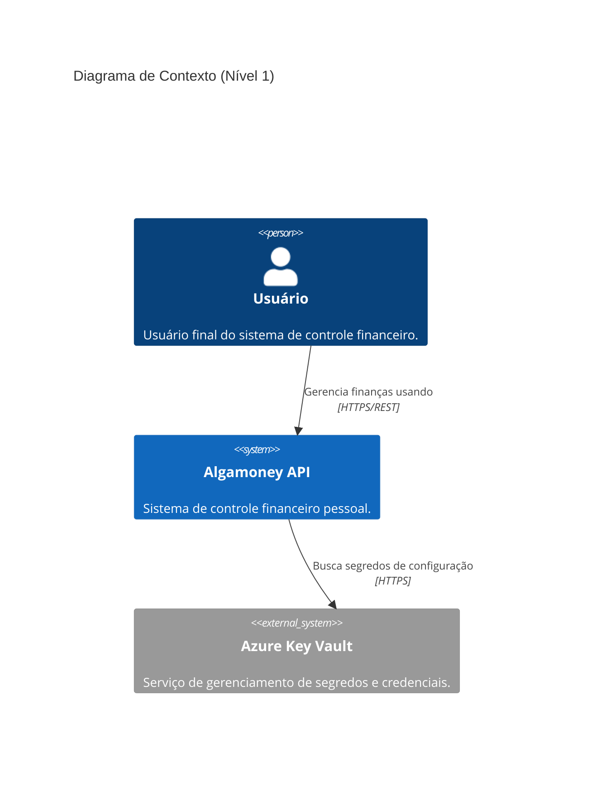
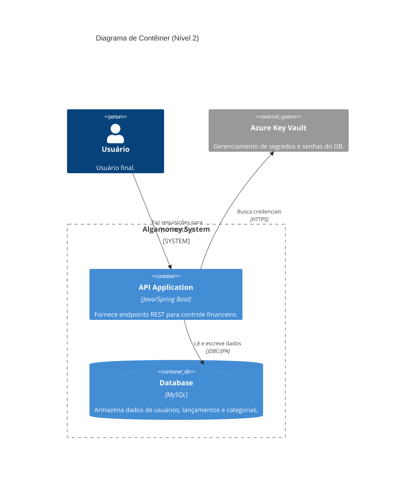
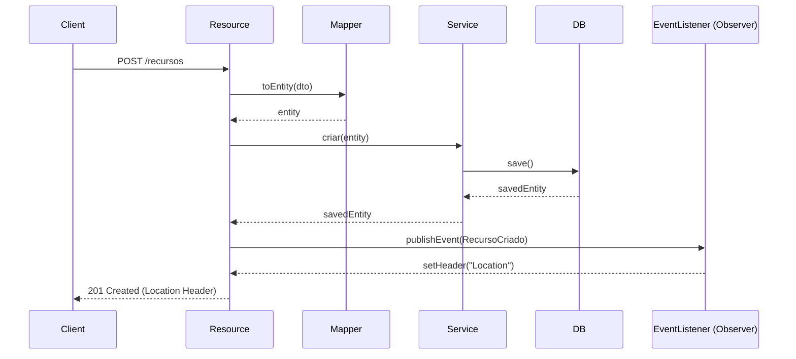

# Algamoney API 💰


## 📖 Sobre o Projeto
O **Algamoney API** é um sistema robusto de controle financeiro pessoal. Ele permite o gerenciamento completo de lançamentos (receitas e despesas), categorias e pessoas, oferecendo uma base sólida para aplicativos de gestão financeira.

---

## 🏗️ Arquitetura (C4 Model)

Utilizamos o **C4 Model** para descrever a arquitetura do sistema em diferentes níveis:

### 1. Diagrama de Contexto (Nível 1)
Mostra como a API se integra com usuários e sistemas externos.



### 2. Diagrama de Contêiner (Nível 2)
Detalha os componentes internos da solução Algamoney.



---

## 🧩 Design Patterns e SOLID

A API foi desenhada para ser modular e fácil de manter, aplicando os seguintes padrões:

### Fluxo de Criação (Observer Pattern)
Abaixo, o fluxo de criação de um novo recurso utilizando o padrão **Observer (Eventos do Spring)** para desacoplar a lógica de geração de Headers HTTP:



### Padrões Aplicados
- **Mapper Pattern**: Desacoplamento entre Entidades de Banco de Dados e DTOs via `PessoaMapper` e `CategoriaMapper`.
- **Observer Pattern**: Utilizado para tratar eventos de infraestrutura (como Location Headers) de forma desacoplada.
- **Domain-Driven Update**: Lógica de atualização de dados encapsulada no modelo de domínio (`Pessoa.atualizarDados()`), removendo lógica anêmica do Service.

---

## 🛠️ Stack Tecnológica
- **Linguagem**: Java 21 (LTS)
- **Framework**: Spring Boot 3.3.2
- **Banco de Dados**: MySQL 8+
- **Migrações**: Flyway
- **Segurança**: Azure Key Vault integration
- **Documentação**: SpringDoc OpenAPI (Swagger)
- **Testes**: JUnit 5, Mockito

---

## 🚀 Como Executar

### Pré-requisitos
- JDK 21
- Maven 3.9+
- MySQL instalado e rodando

### Configuração
1. Configure as variáveis em seu ambiente ou no `application-dev.yml`:
   ```yaml
   NAMEDB: nome_do_banco
   USERNAMEDB: usuario_mysql
   ```
2. Execute o projeto:
   ```bash
   ./mvnw spring-boot:run
   ```
3. Acesse o Swagger em: `http://localhost:8080/swagger-ui.html`

---

## 📄 Licença
Este projeto está sob a licença MIT. 

---
*Relatório de refatoração detalhado disponível em: [relatorio-refatoracao-algamoney.html](./relatorio-refatoracao-algamoney.html)*
